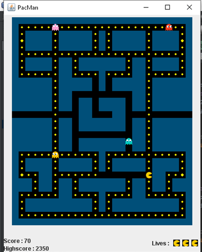

# Pacman revisited

This is a revisited version of the Pacman game. This game comes from an old student project back in 2019.

We tried to stick to the original game as much as possible.

The fun part was developping the ghosts intelligence. Each ghost as its own behavior in the original game, and it's really interesting to discover them and reimplement them.

Here's a photo of the game live : 

The goal of this project was to improve our skills in Java development.